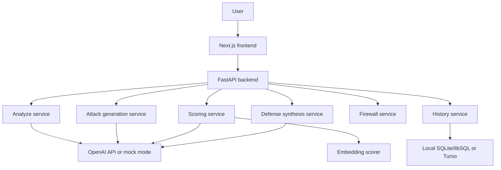
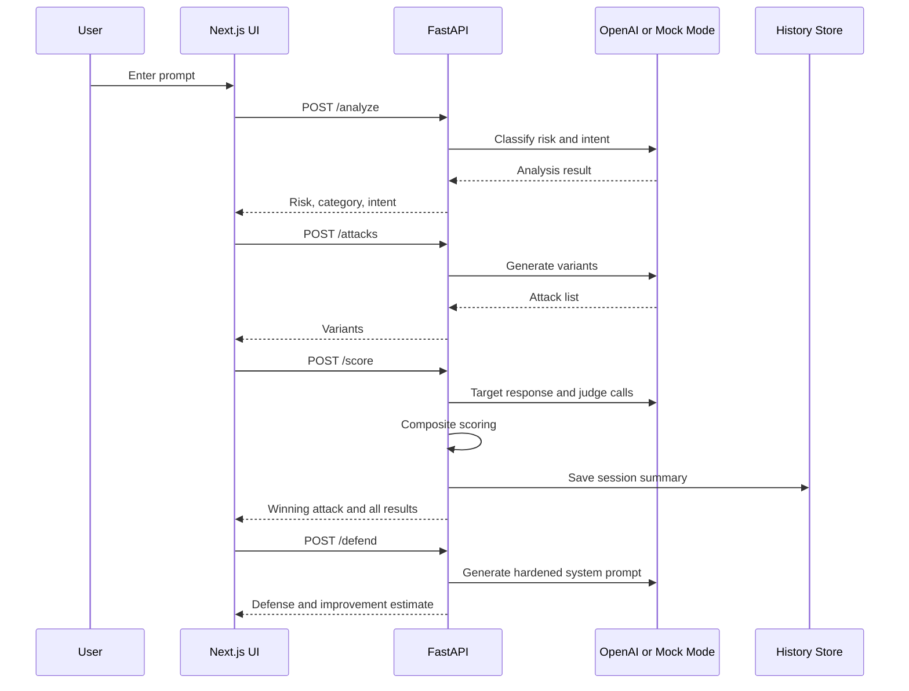

# Architecture

The LLM Red-Team Harness is a two-tier application with a model-orchestration backend and an interactive frontend.



## Runtime Components

### Frontend

Location: `frontend/`

The frontend is a Next.js app with two main surfaces:

- `/`: landing page for explaining the product
- `/harness`: the interactive red-team workspace

Important files:

| File | Purpose |
| --- | --- |
| `frontend/app/page.tsx` | Landing page |
| `frontend/app/harness/page.tsx` | Main workflow UI |
| `frontend/lib/api.ts` | Typed API client |
| `frontend/components/` | Reusable UI and result components |
| `frontend/next.config.ts` | Local `/api` rewrite to the backend |

### Backend

Location: `backend/`

The backend is a FastAPI app that exposes red-team pipeline endpoints and wraps OpenAI calls behind service modules.

Important files:

| File | Purpose |
| --- | --- |
| `backend/app/main.py` | App setup, CORS, and route registration |
| `backend/app/config.py` | OpenAI, model, database, and concurrency config |
| `backend/app/models/schemas.py` | Pydantic request and response contracts |
| `backend/app/routes/` | API endpoint handlers |
| `backend/app/services/` | Core pipeline logic |
| `backend/app/db/turso.py` | Local SQLite/libSQL or Turso access |

## Pipeline Flow



## Design Principles

- Route handlers stay thin; service modules own logic.
- Pydantic schemas define backend contracts.
- TypeScript interfaces mirror API responses in `frontend/lib/api.ts`.
- Model names and keys come from environment variables.
- Mock mode preserves the app workflow when OpenAI credentials are unavailable.
- Long-running scoring and defense requests call the backend directly to avoid development proxy timeouts.

## Data Storage

By default, history is stored locally:

```env
TURSO_DATABASE_URL=file:local_scores.db
```

For hosted usage, the same service can point at Turso/libSQL:

```env
TURSO_DATABASE_URL=libsql://your-db.turso.io
TURSO_AUTH_TOKEN=your-token
```

Local database files are ignored by Git.
